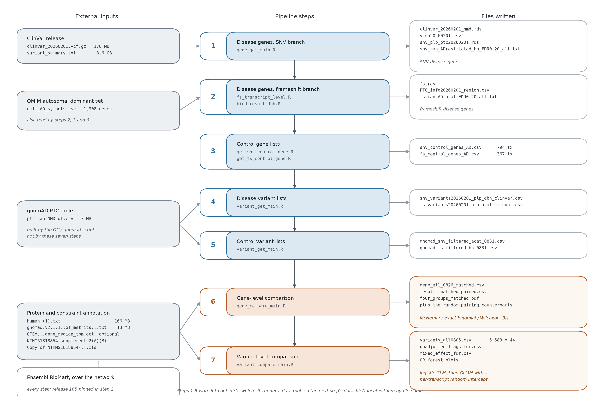

# NMDesc: NMD Escape Annotation & Feature Extraction Pipeline


The **NMDesc pipeline** annotates and analyzes **premature termination codon (PTC) variants from ClinVar**, classifying them by whether they **escape Nonsense-Mediated Decay (NMD)** under canonical **Exon Junction Complex (EJC) rules**.  
It additionally extracts **gene-, variant-, and protein-level features** from multiple genomic and structural databases.

---

## Features

- Canonical NMD escape determination using EJC rules  
- Automated extraction of:
  - Gene-level features (pLI, LOEUF, enrichment analysis, tau, etc.)
  - Variant-level features (PPI annotation, CDS position of the PTC, variant distance to CDS end)
  - Protein-level features (IDRs, Pfam, AlphaFold2)
- FASTA and VCF generation from key(loc:ref:alt) 
- Modular script design for flexible expansion  

---

## Directory Structure

This project includes gene level(NMDesc disease genes and control disease genes), variant level(NMDesc variants from ClinVar and gnomAD) and protein level analysis.

```text
repo_v5/
├── data level_v5/
│   ├── classification.csv
│   ├── MANIFEST.md
│   ├── ship_external_inputs.csv
│   ├── ship_inventory.csv
│   └── ship_regenerable_removed.csv
├── figures/
│   ├── dataflow.pdf
│   ├── dataflow.png
│   ├── result_gene_level_matched.pdf
│   ├── result_gene_level_matched.png
│   ├── result_variant_mixed_effect.pdf
│   └── result_variant_mixed_effect.png
├── gene level_v5/
│   ├── control genes/
│   │   ├── frameshift/
│   │   │   └── get_fs_control_gene.R
│   │   └── snv/
│   │       └── get_snv_control_gene.R
│   ├── disease genes/
│   │   ├── framesift/
│   │   │   ├── bind_result_dbh.R
│   │   │   ├── compare+1-1.R
│   │   │   ├── frameshift_code.R
│   │   │   ├── fs_transcript_level.R
│   │   │   ├── process_syn.R
│   │   │   └── variant_level.R
│   │   └── snv/
│   │       ├── clinar_step1_NMD.R
│   │       ├── ClinVar_NMD.R
│   │       ├── ClinVar_step2_NMD.R
│   │       ├── extract_enriched.R
│   │       ├── get_NMD_enrich2.R
│   │       ├── get_NMD_enrichment_DBH.R
│   │       ├── get_pvalue.R
│   │       ├── main.R
│   │       ├── NMD_annotate.R
│   │       └── process_syn.R
│   ├── features/
│   │   ├── functions/
│   │   │   ├── annotate_motif_flags.R
│   │   │   ├── build_gene_all.R
│   │   │   ├── calculate_ppi_degree_centrality.R
│   │   │   ├── plot_gc_content.R
│   │   │   ├── plot_gene_level_features.R
│   │   │   ├── plot_repeat_content.R
│   │   │   ├── run_pfam_overlap_analysis.R
│   │   │   ├── run_ppi_overlap_analysis.R
│   │   │   └── run_tau_analysis.R
│   │   ├── big_pIc.R
│   │   ├── gene_connectivity.R
│   │   ├── gene_gc.R
│   │   ├── gene_motif.R
│   │   ├── gene_NmdescRegion.R
│   │   ├── gene_overview.R
│   │   ├── gene_pfam.R
│   │   ├── gene_PliLoeuf.R
│   │   ├── gene_plot.R
│   │   ├── gene_plot_match.R
│   │   ├── gene_plot_match2.R
│   │   ├── gene_ppi.R
│   │   ├── gene_repeat.R
│   │   ├── gene_tau.R
│   │   ├── GO_enrich.R
│   │   ├── inheritance.R
│   │   ├── new_loc.R
│   │   └── plot_supplemental_fig3_gene_level.R
│   ├── lib/
│   │   ├── get_statistics.R
│   │   └── paths.R
│   ├── QC/
│   │   ├── check.R
│   │   ├── combine_gene.R
│   │   ├── compare.R
│   │   ├── compare_submitters.R
│   │   ├── cross_check.R
│   │   ├── download_gnomad_syn_vcf.R
│   │   ├── download_syn2.R
│   │   ├── negative_control.R
│   │   ├── parse_gnomad_syn_vcf.R
│   │   ├── process_syn2.R
│   │   ├── select_AD.R
│   │   └── select_AD_variants.R
│   ├── gene_compare_main.R        <- entry point
│   └── gene_get_main.R        <- entry point
├── lib -> gene level_v5/
│   └── lib
├── protein level_v5/
│   ├── AF2/
│   │   └── AF2_draw.R
│   └── fasta/
│       ├── create_fs_control.R
│       └── new_create_fasta.R
├── variant level_v5/
│   ├── clinvar/
│   │   ├── frameshift/
│   │   │   └── get_fs_variant_new.R
│   │   └── snv/
│   │       ├── get_snv_control_variant_new.R
│   │       └── get_snv_variant_new.R
│   ├── emel/
│   │   ├── sequence/
│   │   │   ├── sequence-parsev2_main.R
│   │   │   ├── sequence-peptides_main.R
│   │   │   ├── sequence-peptides_read.R
│   │   │   ├── sequence_cider_main.R
│   │   │   ├── sequence_cider_match.R
│   │   │   ├── sequence_cider_read.R
│   │   │   ├── sequence_cider_table1.R
│   │   │   ├── sequence_parsev2_hier.R
│   │   │   ├── sequence_parsev2_match.R
│   │   │   ├── sequence_parsev2_read.R
│   │   │   ├── sequence_parsev2_table1.R
│   │   │   ├── sequence_peptide_hier.R
│   │   │   ├── sequence_peptide_match.R
│   │   │   └── sequence_peptides_table1.R
│   │   └── structure/
│   │       ├── structure_hier.R
│   │       ├── structure_match.R
│   │       ├── structure_mixed.R
│   │       ├── structure_PAE.R
│   │       ├── structure_plddt.R
│   │       ├── structure_read.R
│   │       ├── structure_table1.R
│   │       └── structure_table2.R
│   ├── features/
│   │   ├── functions/
│   │   │   ├── variant_pfam_ppi.R
│   │   │   └── variants_motif.R
│   │   ├── IDR/
│   │   │   └── idr/
│   │   │       ├── compare_length/
│   │   │       │   ├── compare_idr_length.R
│   │   │       │   ├── compare_idr_snv_control.R
│   │   │       │   ├── idr_difff.R
│   │   │       │   ├── idr_plot.R
│   │   │       │   └── wildtype_idr.R
│   │   │       ├── overlap/
│   │   │       │   ├── get_fs_idr_match.R
│   │   │       │   ├── get_snv_idr_match.R
│   │   │       │   ├── get_snv_idr_match2.R
│   │   │       │   └── idr_main.R
│   │   │       ├── with_in/
│   │   │       │   └── idr_match2.R
│   │   │       ├── get_snv_control_idr.R
│   │   │       ├── idr_merge.R
│   │   │       ├── idr_output.R
│   │   │       └── quality_filter_idr.R
│   │   ├── vep/
│   │   │   ├── process_vep.R
│   │   │   └── vep_draw.R
│   │   ├── clean_motif.R
│   │   ├── create_fasta.R
│   │   ├── csv2vcf.R
│   │   ├── do_AD.R
│   │   ├── do_motif.R
│   │   ├── het_6fasta.R
│   │   ├── merge_loc_uni.R
│   │   ├── number_submitters.R
│   │   ├── parse.R
│   │   ├── pfam_ppi_variant.R
│   │   ├── plus1_control.R
│   │   ├── transcript_features.R
│   │   ├── variant_motif.R
│   │   ├── variant_plot.R
│   │   └── variant_plot2.R
│   ├── gnomad/
│   │   ├── get_gnomAD_control.R
│   │   └── gnomAD_downloaddata.R
│   ├── QC/
│   │   ├── adjust_variant.R
│   │   ├── check_pogz.R
│   │   ├── check_variant_dis.R
│   │   ├── clean_variant_AD.R
│   │   ├── combine_variant.R
│   │   ├── compare_D.R
│   │   ├── plot_negative_control.R
│   │   ├── regression.R
│   │   └── resample.R
│   ├── new_create_fasta_functions.R
│   ├── variant_compare_main.R        <- entry point
│   └── variant_get_main.R        <- entry point
├── CHANGES.md
├── DATAFLOW.md
├── PIPELINE_CHECK.md
├── README.md
└── run_analysis.R        <- entry point
```

---

## Installation

### 1. Install R (≥ 4.2)

Download R from: <https://www.r-project.org/>

### 2. Install required R packages

```{r install-packages, eval=FALSE}
install.packages(c(
  "tidyverse", "data.table", "biomaRt",
  "stringr", "jsonlite", "readr", "ggplot2",
  "scales", "ggpubr" 
))
```

### 3. Optional external tools

| Tool | Purpose |
|------|---------|
| **VEP (Variant Effect Predictor)** | Variant functional annotation |
| **AlphaFold2 models** | Protein structural feature extraction |
| **MetaPredict** | Intrinsic disorder prediction |

---

## Quick Start

```bash
Rscript run_analysis.R --dry-run    # preflight every step, run nothing
Rscript run_analysis.R              # all seven steps, in order
Rscript run_analysis.R 6 7          # a subset
```

`run_analysis.R` drives the seven steps that produce the published comparison:

| Step | Script | Output |
|---|---|---|
| 1 | `gene level_v5/gene_get_main.R` | SNV NMD-escape disease genes |
| 2 | `disease genes/framesift/fs_transcript_level.R`, `bind_result_dbh.R` | frameshift disease genes (per-transcript ACAT / BH) |
| 3 | `control genes/snv/get_snv_control_gene.R`, `control genes/frameshift/get_fs_control_gene.R` | SNV + FS control gene lists |
| 4 | `variant level_v5/variant_get_main.R` | ClinVar P/LP disease variant lists |
| 5 | `variant level_v5/variant_get_main.R` (control inputs switched on) | gnomAD control variant lists |
| 6 | `gene level_v5/gene_compare_main.R` | gene-level comparison, CDS-matched pairs |
| 7 | `variant level_v5/variant_compare_main.R` | variant-level comparison, GLM / GLMM / Bayesian |

`--dry-run` reports, step by step, missing R packages, missing input files and missing session
objects. A failed preflight does not abort the chain: a step whose declared outputs already exist
is marked `cached` and later steps continue from those files, otherwise it is marked `blocked`
with a reason.

The other two levels are run on their own, as before — see **Execution Order**.

---

## How Paths Are Resolved

Everything goes through `gene level_v5/lib/paths.R`:

- One data root, `data level_v5/` inside the repository, located relative to `paths.R` itself and
  overridden by `NMDESC_DATA`. `data_file("name.csv")` looks inputs up by **file name** at any depth
  under it; subdirectory layout does not matter.
- `out_file()` / `out_dir()` write to `NMDESC_OUT`, default `<data root>/output`. That keeps outputs
  inside the search path, so what one step writes the next step finds.
- The first run indexes the data root once and caches it as `.nmdesc_path_index.rds`; a lookup miss
  forces a rescan, so new files are picked up without intervention.

```bash
export NMDESC_DATA=/path/to/data       # only to override the in-repo default
export NMDESC_OUT=/path/to/output
```

The data root holds **inputs only**. Files that a step writes are not shipped in it, so a run starts
at step 1; `data level_v5/ship_regenerable_removed.csv` lists those files and the step that produces
each one. `data level_v5/MANIFEST.md` documents what the inputs are, where they came from, and which
are public downloads that must be fetched separately.

---

## Variant Objects & Usage

### Example: `snv_variants`

| Output | Generated From   | Used For |
|--------|------------------|----------|
| FASTA  | `snv_variants` | IDR analysis, AlphaFold2 inputs |
| VCF    | `snv_variants` | VEP functional annotation |

#### Example: FASTA generation

```{r fasta-example, eval=FALSE}
# library(stringr)
 snv_dis = create_fasta(snv_variants, output_dir = "snv_test_fasta_output")
```

#### Example: Calculate PPI Degree centrality

```{r vcf-example, eval=FALSE}
 calculate_ppi_degree_centrality(
  gene_all,
  output_csv = "wald_ppi_degree_centrality_results.csv"
)
```

---

## Workflow Diagram

```text
ClinVar pipeline
────────────────

ClinVar
  │
  ├─ Select germline variants
  │      ResetID_clinvar_Clnsig.txt
  │
  ├─ NMD annotation
  │      Clinvar_1120.rds
  │
  ├─ Select snv/fs, plp/vus, ptc, nmdesc
  │      Snv_plp_ptc_res1120.rds
  │
  ├─ Add p value
  │      Snv_plp_ptc_p1122.rds
  │
  └─ Get_NMD_enrichment (modify output txt name)
         plus1_can_gene0217.txt


FASTA / VCF branches
────────────────────

From Snv_variants:

  ├─ Create_fasta
  │      → FASTA files (e.g. Minus1_dis)
  │           → IDR analysis / AF2 analysis
  │
  └─ csv2vep
         → Snv.vcf
              (includes key, transcript & uniprot;
               variants identified by key)
         → VEP
              Snv_NMD_result3_vep.txt

```

---

## Downstream Analyses

### 1. Protein domain analysis
- PPI
- PFAM
- SLM, NLS

### 2. Potential confounders
- CDS length
- PTC distance to CDS end
- GC content

### 3. AlphaFold2 Structural Feature Extraction
- pLDDT
- secondary structure
- SASA

### 4. VEP Functional Annotation
- Consequence terms
- Nearest exon junction boundary
- dbNSFP features: Condel_score, GERP scores etc


---

## Output Summary

| Folder | Description |
|--------|-------------|
| `gene_results/` | gene level features |
| `variant_results/` | variant level features |
| `fasta/` | FASTA files for protein-based analyses |
| `vcf/` | VCF files for VEP input |

The two results figures of the seven-step chain are kept in `figures/`:

| Figure | Produced by |
|---|---|
| `result_gene_level_matched.pdf` \| `.png` | step 6, `plot_matched_results()` in `gene_compare_main.R` |
| `result_variant_mixed_effect.pdf` \| `.png` | step 7, `plot_mixed_effect_flags()` in `variant_compare_main.R` |

A run writes its own figures into the same directory.

---


## Execution Order

The three analysis levels are run independently. Each has its own entry point,
and all of them expect `paths.R` to resolve the inputs.

```r
# 1. Gene level
source("gene level_v5/gene_get_main.R")          # ClinVar SNV enrichment      (step 1)
source("gene level_v5/gene_compare_main.R")      # gene-level comparison        (step 6)

# 2. Variant level
source("variant level_v5/variant_get_main.R")     # disease + control variant lists (steps 4, 5)
source("variant level_v5/variant_compare_main.R") # variant feature matrix + models (step 7)

# 3. Protein level
source("protein level_v5/fasta/new_create_fasta.R")  # FASTA for IDR / AF2 input
source("protein level_v5/AF2/AF2_draw.R")            # AF2 structural figures
```

Steps 1-7 are also driven in order by `Rscript run_analysis.R`; the protein level is not part of
that chain and is run on its own.


```text
ClinVar / gnomAD download
        |
        v
aenmd NMD-escape annotation      (ClinVar_NMD.R, NMD_annotate.R)
        |
        v
PTC filtering, canonical transcripts   (clinar_step1_NMD.R, ClinVar_step2_NMD.R)
        |
        +--> gene-level enrichment      (get_NMD_enrich2.R, get_pvalue.R)
        +--> variant feature matrix     (transcript_features.R, variant_motif.R)
        +--> control sets               (control genes/, gnomad/)
        |
        v
feature extraction  (pfam, ppi, motif, gc, repeat, tau, IDR, VEP, AF2)
        |
        v
statistics and figures   (features/*_plot*.R, emel/, QC/)
```

External steps are run outside R and their output read back in:

| Step | Tool | Consumed by |
|------|------|-------------|
| Variant annotation | VEP | `variant level_v5/features/vep/process_vep.R` |
| Disorder prediction | metapredict | `variant level_v5/features/IDR/idr/` |
| Structure prediction | AlphaFold2 | `protein level_v5/AF2/AF2_draw.R` |
| Sequence properties | CIDER / PARSE | `variant level_v5/emel/sequence/` |

---

## Statistical Methods in the Code

Tests and models used, with the number of scripts referencing each.

| Method | Scripts | Typical use |
|--------|---------|-------------|
| Wilcoxon | 37 | Paired and unpaired feature comparisons |
| BH / FDR | 24 | Multiple-testing correction across feature panels |
| Fisher exact | 13 | Gene- and variant-level enrichment tables |
| binomial exact | 7 | Observed vs expected NMD-escape counts |
| GLMM (lme4) | 7 | Mixed-effect models with gene or protein random intercepts |
| Bayesian GLMM (brms) | 4 | Sensitivity analysis for degenerate fits |
| McNemar | 3 | Paired categorical flag comparisons |
| chi-squared | 3 | Categorical contingency tests |
| t-test | 3 | Continuous feature comparisons |
| logistic regression | 3 | Binary outcome modelling on variant features |
| STRINGdb centrality | 3 | PPI degree centrality per gene |
| DiscreteFDR | 2 | FDR correction for discrete test statistics |
| Spearman | 2 | Rank correlation between p-value methods |
| ACAT | 1 | Aggregated Cauchy combination of per-transcript p-values |
| Tarone | 1 | Filtering structurally unreachable discrete tests |
| Kruskal-Wallis | 1 | Multi-group comparisons |
| bootstrap/resampling | 1 | Repeated sampling of one variant per protein |

---

---

## Data Flow: Inputs, Intermediates, Outputs



File names are referenced by basename throughout — `data_file()` in `paths.R` looks them up by name under the data root, regardless of subdirectory structure.

### 1. External Inputs (not produced by the pipeline, must be prepared in advance)

| File | Size | Used in | What it is |
|---|---|---|---|
| `clinvar_20260201.vcf.gz` | 178 MB | 1 | Full ClinVar VCF, the starting point of the entire pipeline |
| `variant_summary.txt` | 3.6 GB | 1 | ClinVar tab-delimited table, provides `NumberSubmitters`, `ReviewStatus`, used for variant-level QC |
| `omim_AD_symbols.csv` | 1,908 rows | 1, 2, 3, 6 | OMIM autosomal dominant gene symbols, the AD restriction used throughout the pipeline |
| `ptc_can_NMD_df.csv` | 7 MB | 4, 5 | gnomAD PTC table, source of control variants (produced separately by scripts under `QC/` and `gnomad/`, not part of these seven steps) |
| `human (1).txt` | 166 MB | 6, 7 | Protein interaction interface table, PPI overlap feature |
| `variants_all0901.csv` | 53 MB | 7 | Master variant feature table, the authoritative input for the published results. On this machine it is at `~/Downloads/`, **not on any data root** — move it into the data root (`data level_v5/`) or point `NMDESC_DATA` at the directory containing it, otherwise step 7 will fall back to the table assembled on-the-fly in section 4.0, giving inconsistent ORs |
| `gnomad.v2.1.1.lof_metrics.by_gene.txt` | 13 MB | 6 | pLI / LOEUF constraint metrics |
| `GTEx_Analysis_v10_..._gene_median_tpm.gct` | — | 6 | Tissue expression, tau feature; `must = FALSE`, the column is NA if missing |
| `NIHMS1818854-supplement-2(A).csv` | — | 6, 7 | transcript → UniProt mapping |
| `NIHMS1818854-supplement-2(B).csv` | — | 6, 7 | motif annotation (SLiM / MoRF / PTM / NLS) |
| `Copy of NIHMS1818854-supplement-2.xls` | — | 6, 7 | Low-complexity sequence (LCS) annotation |

In addition, every step requires network access to Ensembl BioMart (step 2 pins release 105).
`variant_summary.txt`, `gnomad.v2.1.1.lof_metrics.by_gene.txt`, and `human (1).txt`
are not distributed with the code due to size or licensing restrictions, see `data level_v5/MANIFEST.md`. (`data level_v5/MANIFEST.md` also lists
`genemap2.txt`, but none of the scripts in these seven steps read it — it only appears in the documentation example comment in `paths.R`,
so there is no need to download it to run this pipeline.)

### 2. Intermediate Products Passed Between the Seven Steps

```text
                      clinvar_20260201.vcf.gz
                      variant_summary.txt
                      omim_AD_symbols.csv
                               |
   [1] gene_get_main.R         |  aenmd NMD-escape annotation, EJC rules
                               v
        clinvar_20260201_nmd.rds        annotated GRanges, all ClinVar variants
        v_ch20260201.csv                2 GB QC table, submitter / review status
        snv_plp_ptc20260201.rds         control POOL: snv & plp & ptc
        snv_plp_ptc_nmdesc_can*.rds     escape & canonical subset
        snv_can_ADrestricted_bh_FDR0.20_all.txt     <-- SNV disease genes
                               |
   [2] fs_transcript_level.R   |  frameshift branch, per-transcript
       bind_result_dbh.R       |  ACAT + Tarone + BH
                               v
        fs.rds                          frameshift plp+ptc pool
        fs_benign.rds                   benign frameshift set
        PTC_info20260201_region.csv     NMDesc region per transcript
        fs_can_AD_acat_FDR0.20_all.txt              <-- FS disease genes
                               |
   [3] get_snv_control_gene.R  |  pool minus escape-carrying transcripts,
       get_fs_control_gene.R   |  then canonical + multi-exon + OMIM AD
                               v
        snv_control_genes_AD.csv        794 transcripts
        fs_control_genes_AD.csv         367 transcripts
                               |
   [4] variant_get_main.R      |  ClinVar P/LP variants in the disease genes
                               v
        snv_variants20260201_plp_dbh_clinvar.csv
        fs_variants20260201_plp_acat_clinvar.csv
                               |
   [5] variant_get_main.R      |  same script, control gene inputs switched on;
       (CFG$*_control_gene_file)|  gnomAD variants on the same transcripts
                               v
        gnomad_snv_filtered_acat_0831.csv
        gnomad_fs_filtered_bh_0831.csv
                               |
              +----------------+----------------+
              |                                 |
   [6] gene_compare_main.R            [7] variant_compare_main.R
       CDS-length matched pairs           GLM / GLMM / Bayesian
```

The output of each step is written to `out_dir()` (default `<data root>/output`). This directory sits under the
data root, so `data_file()` in the next step can find it by name — this is the only interface between steps.

### 3. Final Outputs

**Step 6, gene level** (each disease gene matched 1:1 with a control gene by CDS length)

| File | Contents |
|---|---|
| `gene_all_0826_matched.csv` | Full gene feature table for the matched design, each row carries `pair_id` and `group` |
| `gene_all_0826_random.csv` | Random pairing design, as a control for the matching scheme |
| `pairs_{snv,fs}_{matched,random}.csv` | Pairing details |
| `results_matched_paired.csv` | Paired test results: McNemar / exact binomial (binary features), Wilcoxon (continuous features), plus BH, Holm, and global correction |
| `results_random_unpaired.csv` | Unpaired test results under random pairing |
| `four_groups_{matched,random}.pdf` | Distribution plots of features across the four groups (snv / snv_control / fs / fs_control), with significance brackets |
| **`result_gene_level_matched.pdf`** | **Results figure**: paired positive rate for binary flags, paired shift for continuous features, CDS pairing quality. Plotted by `plot_matched_results()` in section 9a |
| `group_summary_*.csv`, `group_features_*.csv` | Descriptive statistics |

**Step 7, variant level** (one row per variant, random intercept by gene/protein)

| File | Contents |
|---|---|
| `variants_all0805.csv` | Master variant feature table, 5,583 rows x 44 columns |
| `variants_annotated.csv` | PPI / Pfam annotation intermediate table |
| `unadjusted_flags_fdr.csv` | Unadjusted logistic regression, one OR per flag |
| `mixed_effect_fdr.csv` | Mixed-effects GLMM (`lme4`), random intercept by `ensembl_transcript_id` |
| `ppi_pfam_flag_summary.csv` | Summary of flag positive rates |
| **`result_variant_mixed_effect.pdf`** | **Results figure**: one OR per flag, faceted by branch, log axis, confidence intervals, BH significance stars, number of variants included in the model. Plotted by `plot_mixed_effect_flags()` in section 4.2 |
| Other forest plots | Unadjusted and Bayesian OR forest plot pairs |

If `brms` is missing, the Bayesian sensitivity analysis in step 7 (section 4.3) is automatically skipped, and the rest proceeds as normal.

### 4. Summary in One Sentence

The input is **the ClinVar VCF + gnomAD PTC table + OMIM AD gene table + several protein/constraint annotation sources**;
the intermediate is **four gene lists** — SNV disease genes, FS disease genes, two sets of control genes, and the
**four variant lists** derived from them (SNV/FS × disease/control); the output is **two layers of comparison statistics tables and two results figures** (`result_gene_level_matched.pdf`,
`result_variant_mixed_effect.pdf`, each plotted by the step 6 and step 7 scripts respectively):
at the gene level, features are compared between CDS-length-matched pairs; at the variant level, flag ORs are compared using mixed-effects models.

---

## Contact

**Maintainer:** Jiaoyang Xu (JXU)  
Email: [jiaoyang.xu@uth.tmc.edu]

---
